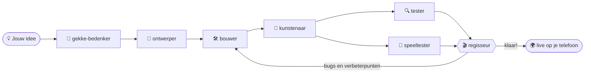

# 🎮 Jorts Game Studio

Geef een idee voor een game, en een **team van AI-agents** maakt er een grappige **party game** van die je **live met vrienden speelt, ieder op een eigen telefoon, tablet of laptop**. Geen app, geen account: een link openen is genoeg.

**▶️ Speel:** https://jortjeeltink-create.github.io/Jort-Eeltink/ (na het [eenmalig instellen](#eenmalig-instellen-github-pages))

## Samen spelen

1. Eén iemand opent een game en tikt op **🎉 Nieuw spel starten**.
2. De rest scant de **QR-code** op dat scherm, of typt de code van 4 letters in.
3. De host drukt op **▶️ Start**. Met te weinig spelers voeg je een 🤖 bot toe.

Telefoons krijgen een joystick en knoppen op het scherm; op een laptop speel je met WASD/pijltjes en spatie, en een controller werkt ook.

## Het team



| Agent | Wat doet het? |
|---|---|
| 🎬 **regisseur** | De hoofdsessie (`CLAUDE.md`): verdeelt het werk, bewaakt de kwaliteit, houdt jou op de hoogte. |
| 🤪 `gekke-bedenker` | Super origineel: verzint gekke twists, absurde power-ups, chaos-momenten en running gags. |
| 🎲 `ontwerper` | Maakt er een simpel, eerlijk en spannend spel van dat je in 10 seconden snapt. |
| 🛠️ `bouwer` | Programmeert de game en lost bugs op. |
| 🎨 `kunstenaar` | Kleuren, tekeningen, animaties, geluid, trillen, schudden: alles wat het lekker laat voelen. |
| 🔍 `tester` | De controleur: laat de game automatisch spelen op laptop, iPhone, Android en iPad tegelijk, bekijkt screenshots en zoekt bugs. |
| 🎉 `speeltester` | Beoordeelt als een vriendengroep of het écht leuk is, met een cijfer en verbeterpunten. |

Een game is pas klaar als de tester ✅ geeft en de speeltester minstens een 7.

## Commando's

Open deze repository in [Claude Code](https://claude.ai/code) en typ:

| Commando | Wat er gebeurt |
|---|---|
| `/nieuwe-game <idee>` | Het hele team maakt een nieuwe game, van idee tot live. Bijv. `/nieuwe-game iedereen is een pinguïn die vissen moet stelen` |
| `/gekker <game>` | Chaos-update: de gekke bedenker verzint een nieuwe twist en het team bouwt hem erin |
| `/verbeter <game> <wat>` | Iets fixen of veranderen, bijv. `/verbeter botsbal de dash is te sterk` |
| `/test <game>` | Tester en speeltester beoordelen een game |

## Hoe het werkt

- Elke game is een webpagina, dus hij werkt op alles met een browser.
- Het apparaat van de host rekent het spel uit en stuurt de stand 20 keer per seconde rechtstreeks naar de andere apparaten (peer-to-peer via WebRTC). Een eigen server is niet nodig.
- Alle games gebruiken dezelfde **party-engine** (`engine/`). Die regelt de lobby, de QR-code, de verbinding, de besturing, bots, geluid en effecten. Handleiding: [`engine/README.md`](engine/README.md).

**Goed om te weten:** iedereen heeft internet nodig. Het host-apparaat moet het scherm aan houden. Sommige strenge netwerken, zoals school-wifi, blokkeren peer-to-peer; gebruik dan mobiele data of een hotspot.

## Eenmalig instellen: GitHub Pages

Zodat de games online staan:

1. Ga op GitHub naar deze repository → **Settings** → **Pages**.
2. Bij **Source**: kies **Deploy from a branch**, branch **main**, map **/ (root)** → **Save**.
3. Na ±1 minuut staat alles op https://jortjeeltink-create.github.io/Jort-Eeltink/

Elke keer dat het team een game naar `main` pusht, staat hij een minuut later online.

## Zelf testen op je computer

Je hebt [Node.js](https://nodejs.org) nodig.

```bash
npm install
npx playwright install chromium   # eenmalig, voor de automatische speltest
npm run dev                       # http://localhost:8080
npm run playtest -- botsbal       # 4 apparaten spelen automatisch samen
```

## Mappen

```
games/<game>/       één map per game: index.html, game.js, en de notities van het team
                    (prompt, ideeen, ontwerp, testrapport, speeltest)
games/games.json    lijst van alle games voor de startpagina
engine/             de party-engine (multiplayer, besturing, geluid, effecten)
tools/              lokale server en automatische speltest
.claude/agents/     het team
.claude/skills/     de commando's
index.html          de startpagina met alle games
```
