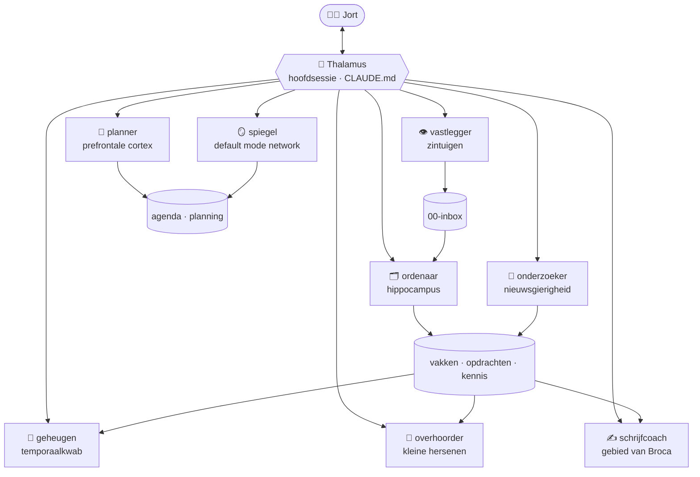

# 🧠 Het brein van Jort

Een **tweede brein voor school**: een map met notities die wordt bijgehouden door een team van AI-agents in [Claude Code](https://claude.com/claude-code). Jij praat met het brein; het brein zet het juiste deel aan het werk.

Elke agent is gekoppeld aan een deel van de hersenen dat iets vergelijkbaars doet.



## Het team

| Agent | Hersengebied | Wat doet het? |
|---|---|---|
| **thalamus** | Schakelstation | De hoofdsessie (`CLAUDE.md`). Begrijpt wat je wilt en stuurt het naar de juiste agents, soms meerdere tegelijk. |
| `vastlegger` | Zintuigen | Legt alles snel vast in de inbox: ideeën, aantekeningen, links, opdrachten. |
| `ordenaar` | Hippocampus | Verwerkt de inbox: zet alles bij het juiste vak of de juiste opdracht en legt verbanden. |
| `geheugen` | Temporaalkwab | Beantwoordt vragen uit je eigen notities, met verwijzingen. |
| `onderzoeker` | Nieuwsgierigheid | Zoekt dingen uit op internet, met betrouwbare bronnen. |
| `planner` | Prefrontale cortex | Houdt toetsen en deadlines bij en maakt leer-, dag- en weekplanningen. |
| `overhoorder` | Kleine hersenen | Maakt flashcards en oefentoetsen en houdt bij wat je al beheerst. |
| `schrijfcoach` | Gebied van Broca | Helpt met verslagen en presentaties: opzet, feedback, bronnenlijst. |
| `spiegel` | Default mode network | Weekreview: wat ging goed, waar loop je achter, waar focus je op? |

## Commando's

| Commando | Wat het doet | Welke agents |
|---|---|---|
| `/kennismaken` | Het brein leert je kennen en maakt je vakken aan | thalamus → ordenaar → planner |
| `/vang <iets>` | Snel iets vastleggen | vastlegger (→ planner) |
| `/verwerk` | Inbox opruimen | ordenaar (→ planner) |
| `/vraag <vraag>` | Antwoord uit je eigen notities | geheugen |
| `/onderzoek <onderwerp>` | Uitzoeken met bronnen | onderzoeker → ordenaar |
| `/toets <vak> <datum> <stof>` | Agenda, leerplanning en oefenvragen | planner ∥ overhoorder |
| `/overhoor <onderwerp>` | Laat je overhoren | thalamus + overhoorder |
| `/schrijf <opdracht>` | Opzet, feedback of bronnenlijst | geheugen ∥ onderzoeker → schrijfcoach |
| `/dagstart` | Wat doe ik vandaag? | planner |
| `/weekreview` | Terugblikken en vooruit plannen | spiegel → planner |

Je hoeft geen commando te gebruiken: gewoon iets vragen werkt ook ("ik heb vrijdag een toets Frans over H2, help me plannen").

## Aan de slag

1. Open deze repository in Claude Code: op het web via [claude.ai/code](https://claude.ai/code), of op je computer met `claude` in deze map.
2. Typ `/kennismaken`. Het brein stelt je een paar vragen en maakt je vakken aan.
3. Gebruik daarna elke dag `/vang` voor alles wat je wilt onthouden en `/dagstart` om je dag te plannen.

**Tip:** open deze map als *vault* in [Obsidian](https://obsidian.md) om door je brein te bladeren. De `[[links]]`, de takenlijsten (plugin *Tasks*) en de flashcards (plugin *Spaced Repetition*) werken daar meteen.

## Mappen

```
00-inbox/          alles wat binnenkomt
10-vakken/<vak>/   per vak een overzicht + lesnotities
20-opdrachten/     werkstukken, presentaties, projecten
30-kennis/         onderzoek en bronnen
40-archief/        afgerond
50-planning/       agenda, dagplanningen, weekreviews
60-oefenen/        flashcards en oefentoetsen
90-sjablonen/      sjablonen voor elk soort notitie
HOME.md            startpagina
over-mij.md        jouw profiel
```

## Aanpassen

- **Agents** staan in `.claude/agents/`, **commando's** in `.claude/skills/<naam>/SKILL.md`. Het zijn gewone tekstbestanden: pas ze aan of voeg er een toe.
- **Hoe het brein werkt** (regels, conventies, welke agent wanneer) staat in `CLAUDE.md`.
- **Instellingen** staan in `.claude/settings.json`. Het brein mag zonder te vragen notities bewerken, op internet zoeken en commits maken. Alles staat in git, dus je kunt elke wijziging terugdraaien.
- **Leren, niet spieken:** de schrijfcoach helpt je zelf beter te schrijven en levert standaard geen complete inleverteksten. Vul in `over-mij.md` in wat je school toestaat.
